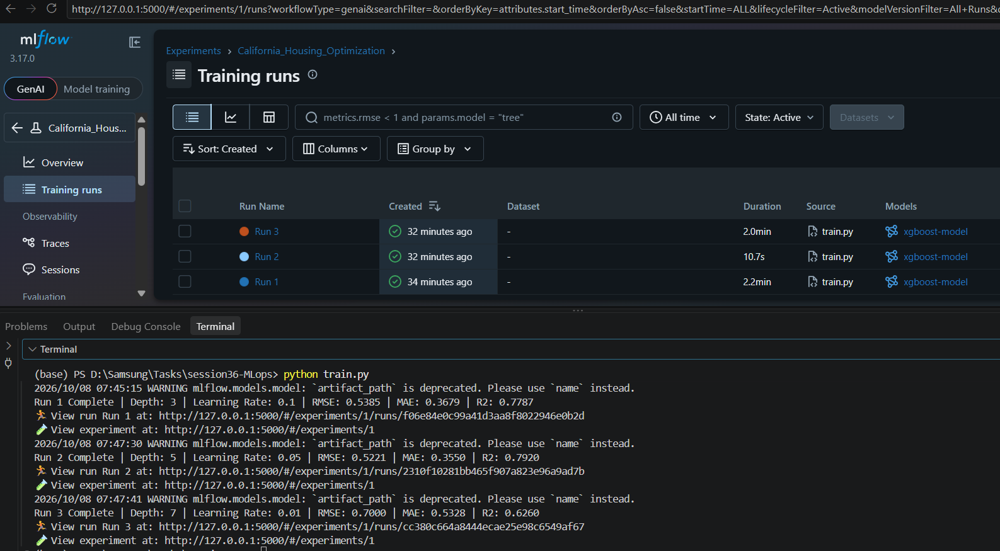

# ML Experiment Tracking with MLflow


## Table of Contents

1. [Project Description](#1-project-description)
2. [Dataset](#2-dataset)
3. [Technologies and Libraries](#3-technologies-and-libraries)
4. [Experiment Configurations](#4-experiment-configurations)
5. [Evaluation Metrics](#5-evaluation-metrics)
6. [Results](#6-results)
7. [MLflow Experiment Tracking](#7-mlflow-experiment-tracking)
8. [Best Model](#8-best-model)
9. [How to Run the Project](#9-how-to-run-the-project)
10. [Project Structure](#10-project-structure)
11. [Conclusion](#11-conclusion)

---

## 1. Project Description

This project demonstrates how to use MLflow to track, evaluate, and compare multiple machine learning experiments.

The task is based on the California Housing dataset. An XGBoost regression model was trained three times using different hyperparameter configurations.

The main goal is to determine which hyperparameter configuration produces the best prediction performance.

The experiments follow the workflow:

**Train → Track → Compare → Select**

---

## 2. Dataset

The California Housing dataset was used for the house price prediction problem.

The dataset was split into:

- **80% Training Data**
- **20% Validation Data**

A fixed random seed of `42` was used to make the data split reproducible.

---

## 3. Technologies and Libraries

The project uses the following Python libraries:

- **MLflow** — For experiment tracking and model logging.
- **XGBoost** — For training the regression model.
- **Scikit-learn** — For loading the dataset, splitting the data, and calculating evaluation metrics.
- **Pandas** — For data handling.
- **NumPy** — For numerical operations.

---

## 4. Experiment Configurations

The same XGBoost regression model was trained three times using different hyperparameters.

| Run   | Max Depth | Learning Rate |
|-------|-----------|---------------|
| Run 1 | 3         | 0.1           |
| Run 2 | 5         | 0.05          |
| Run 3 | 7         | 0.01          |

For every experiment, MLflow was used to track:

- `max_depth`
- `learning_rate`
- RMSE
- MAE
- R²
- Trained model artifact

---

## 5. Evaluation Metrics

The following validation metrics were used to evaluate the models.

### RMSE

Root Mean Squared Error measures the average magnitude of prediction errors.

A lower RMSE indicates better model performance.

### MAE

Mean Absolute Error measures the average absolute difference between the predicted and actual values.

A lower MAE indicates better performance.

### R²

R² measures how well the model explains the variance in the target variable.

A higher R² generally indicates better performance.

For this task, **RMSE was used as the primary metric for model selection**.

---

## 6. Results

The three experiments produced the following validation results:

| Run   | Max Depth | Learning Rate | RMSE       | MAE        | R²         |
|-------|-----------|---------------|------------|------------|------------|
| Run 1 | 3         | 0.1           | 0.5385     | 0.3679     | 0.7787     |
| Run 2 | 5         | 0.05          | **0.5221** | **0.3550** | **0.7920** |
| Run 3 | 7         | 0.01          | 0.7000     | 0.5328     | 0.6260     |

---

## 7. MLflow Experiment Tracking

MLflow was used to track the three experiments and store their parameters, metrics, and trained models.

The MLflow UI allows the runs to be compared in one place.

### MLflow Results



---

## 8. Best Model

### Selected Model: Run 2

The best-performing model is **Run 2**, using:

- **Max Depth:** 5
- **Learning Rate:** 0.05
- **RMSE:** 0.5221
- **MAE:** 0.3550
- **R²:** 0.7920

Run 2 was selected because it achieved the **lowest RMSE (0.5221)** among the three experiments.

Since RMSE was defined as the primary metric for model selection, Run 2 is considered the best model configuration.

---

## 9. How to Run the Project

### Step 1 — Install the Dependencies

Install the required Python libraries using:

```bash
pip install -r requirements.txt
```

### Step 2 — Start MLflow

Start the MLflow UI using:

```bash
mlflow ui
```

The MLflow UI can then be opened in the browser at:

```
http://127.0.0.1:5000
```

### Step 3 — Run the Training Script

In another terminal, run:

```bash
python train.py
```

The script will:

1. Load the California Housing dataset.
2. Split the data into training and validation sets.
3. Train three XGBoost models.
4. Calculate RMSE, MAE, and R².
5. Log parameters and metrics to MLflow.
6. Log each trained model as an MLflow artifact.

---

## 10. Project Structure

```
mlflow-task/
│
├── train.py
├── requirements.txt
├── README.md
└── mlflow-results.png
```

---

## 11. Conclusion

This experiment demonstrates how MLflow can be used to track and compare machine learning experiments.

Three different XGBoost configurations were trained and evaluated.

Based on the primary evaluation metric, RMSE, Run 2 with `max_depth = 5` and `learning_rate = 0.05` was selected as the best-performing model.

The experiment demonstrates the complete machine learning workflow:

**Train → Track → Compare → Select**
